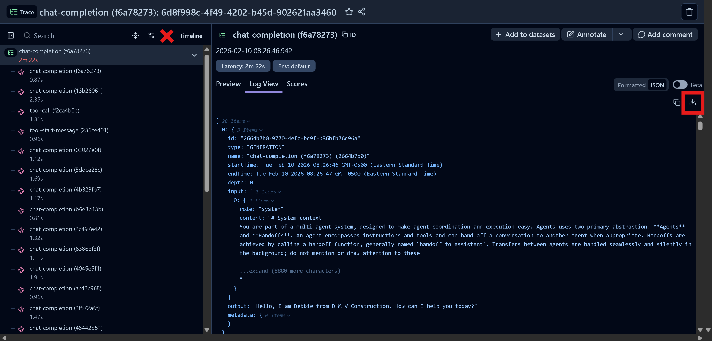

# Langfuse-Trace-Importer

A Python script for importing exported Langfuse traces back into Langfuse, preserving the complete trace structure, observations, and conversation history.

## Instalation/Requirements
- Download trace_importer_fixed.py
- pip install requests python-dotenv
- Create a .env file in the same directory:
LANGFUSE_PUBLIC_KEY=pk-lf-...
LANGFUSE_SECRET_KEY=sk-lf-...

## Usage
Download an existing trace from Langfuse using the button in Log View:

#### Basic Usage
python trace_importer_fixed.py trace_export.json
#### With Command Line Credentials
python trace_importer_fixed.py trace_export.json \
  --public-key pk-lf-... \
  --secret-key sk-lf-... \
  --host https://us.cloud.langfuse.com
